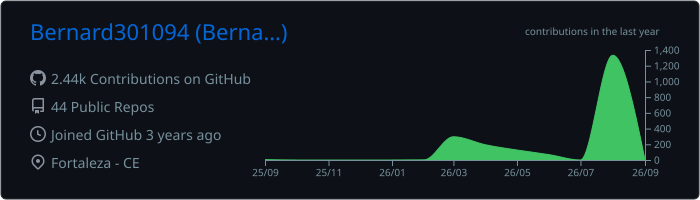
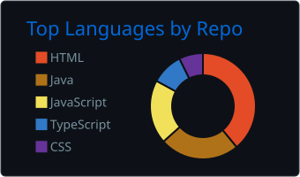
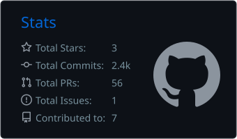
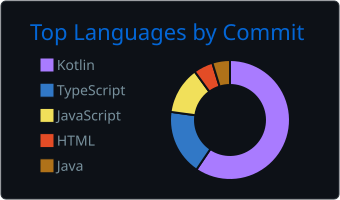
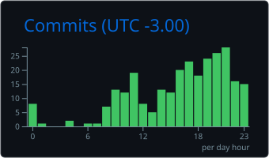

<h3>Construindo soluções reais através de software.</h3>

Estudante de <strong>Análise e Desenvolvimento de Sistemas</strong> 
com foco em desenvolvimento de software, Android, backend, bancos de dados e APIs.

 

---

## 👨‍💻 Sobre mim

Olá! Sou **Bernard De Freitas**, venezuelano vivendo em **Fortaleza, Ceará 🇧🇷**.

Minha principal forma de aprender desenvolvimento é transformando **problemas reais em soluções de software**.

Tenho trabalhado em projetos envolvendo aplicações Android, sistemas web, bancos de dados, APIs, automações e integração de inteligência artificial.

Atualmente estou aprofundando meus conhecimentos principalmente em **Java, Android, backend e bancos de dados**, com atenção cada vez maior à arquitetura, segurança, experiência do usuário e qualidade do código.

 

<table>
<tr>
<td width="30%"><strong>📍 Localização</strong></td>
<td>Fortaleza, Ceará — Brasil</td>
</tr>
<tr>
<td><strong>🎓 Formação</strong></td>
<td>Análise e Desenvolvimento de Sistemas</td>
</tr>
<tr>
<td><strong>💻 Área</strong></td>
<td>Desenvolvimento de Software</td>
</tr>
<tr>
<td><strong>🎯 Foco atual</strong></td>
<td>Java · Android · Backend · SQL</td>
</tr>
<tr>
<td><strong>🌱 Metodologia</strong></td>
<td>Aprender construindo projetos reais</td>
</tr>
</table>

 

---

## 🚀 Projetos em destaque

<table>
<tr>
<td width="50%" valign="top">

<h3 align="center">☕ PontoCafe</h3>

Sistema Android para gerenciamento de pausas de café, identificação facial e controle de acesso por perfis.

<strong>Principais recursos</strong>

- 📱 Aplicação Android
- 👤 Reconhecimento facial
- 🔐 Perfis e níveis de acesso
- 🖥️ Modo terminal / ponto
- ⏱️ Controle de pausas e horários
- 🗄️ Persistência de dados
- 🔒 Autenticação e segurança

 

</td>
<td width="50%" valign="top">

<h3 align="center">🌿 FloraCareAI</h3>

Aplicação inteligente para identificação e acompanhamento de plantas utilizando dados ambientais e inteligência artificial.

<strong>Principais recursos</strong>

- 📱 Android
- 🌱 Identificação de plantas
- 🔌 Integração com APIs
- 🤖 Inteligência artificial
- 🌦️ Dados climáticos
- 💧 Recomendações adaptativas
- 🗄️ Persistência de informações

 

</td>
</tr>
<tr>
<td width="50%" valign="top">

<h3 align="center">📊 Gestão de Absenteísmo</h3>

Sistema voltado ao acompanhamento de efetivo, ausências e distribuição operacional de colaboradores.

<strong>Principais recursos</strong>

- 👥 Gestão de colaboradores
- 📊 Indicadores operacionais
- 🗂️ Organização de efetivo
- 📈 Acompanhamento de ausências
- ⚙️ Regras de negócio
- 💻 Interface orientada ao uso real

 

</td>
<td width="50%" valign="top">

<h3 align="center">🧪 Outros projetos</h3>

Utilizo meu GitHub também como laboratório para estudar novas tecnologias, arquiteturas e conceitos de desenvolvimento.

<strong>Áreas de estudo</strong>

- ☕ Java
- 🔌 APIs REST
- 🗄️ SQL
- 📱 Android
- 🔄 Git
- ⚙️ Automação
- 🤖 IA aplicada

 

</td>
</tr>
</table>

 

---

## 🛠️ Stack tecnológica

### 💻 Linguagens

 

### 🗄️ Bancos de dados

 

### 🌐 Desenvolvimento Web

 

### 🔧 Ferramentas

 

---

## 🧩 Conhecimentos

<table>
<tr>
<td width="30%"><strong>☕ Backend</strong></td>
<td>Java · APIs REST · Integração de serviços</td>
</tr>
<tr>
<td><strong>🌐 Frontend</strong></td>
<td>HTML · CSS · JavaScript · Bootstrap</td>
</tr>
<tr>
<td><strong>📱 Mobile</strong></td>
<td>Android</td>
</tr>
<tr>
<td><strong>🗄️ Banco de dados</strong></td>
<td>PostgreSQL · SQL Server · SQLite</td>
</tr>
<tr>
<td><strong>🔄 Versionamento</strong></td>
<td>Git · GitHub</td>
</tr>
<tr>
<td><strong>🛠️ Ferramentas</strong></td>
<td>IntelliJ IDEA · VS Code · Figma</td>
</tr>
<tr>
<td><strong>🤖 Outros</strong></td>
<td>APIs · Automação · Inteligência Artificial</td>
</tr>
</table>

 

---

## 🧠 Como eu desenvolvo

Meu objetivo não é simplesmente acumular tecnologias.

Procuro primeiro compreender o problema e, a partir disso, encontrar uma solução que seja **funcional, segura, simples de manter e adequada ao contexto real**.

 

### Problema → Análise → Implementação → Testes → Refatoração → Evolução

 

Durante esse processo, busco desenvolver principalmente conhecimentos relacionados a:

- arquitetura e organização de código;
- experiência do usuário;
- modelagem e persistência de dados;
- integração entre sistemas;
- APIs;
- segurança;
- tratamento de erros;
- testes;
- manutenção;
- evolução contínua do software.

 

---

## 📊 GitHub

Estatísticas geradas automaticamente a partir da minha atividade pública real no GitHub.

 

  

  

  

Atualização automática diária via GitHub Actions.

 

---

## 🌎 Idiomas

 

---

## 📬 Contato

<h3>Vamos conectar?</h3>

Aberto a oportunidades profissionais, colaboração em projetos 
e troca de conhecimento sobre desenvolvimento de software.

 

   

<strong>Desenvolvendo, aprendendo e evoluindo um projeto de cada vez.</strong>

  

